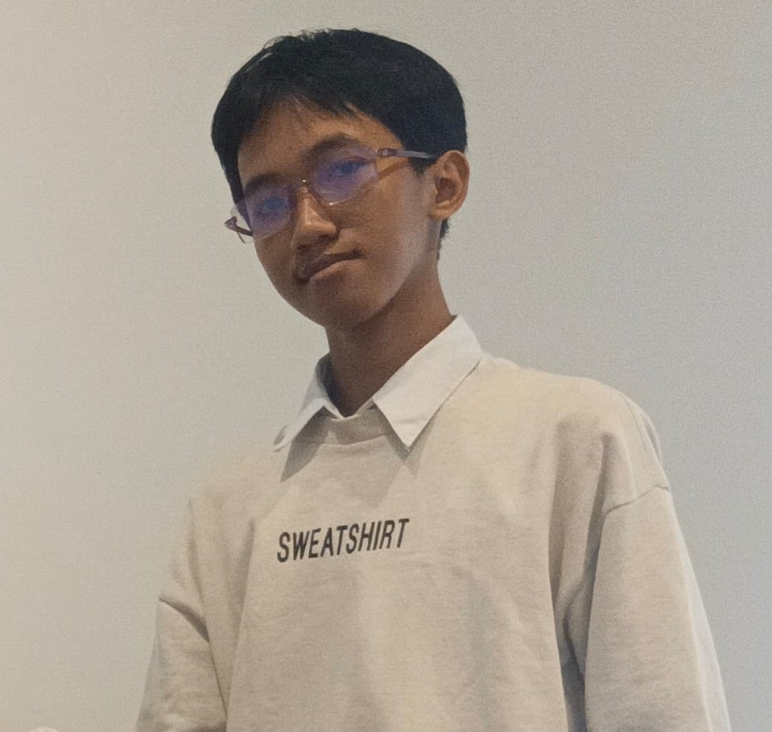

# Zain — Portfolio

Personal portfolio website for **Zainur Rochim** — SMK RPL student, tech enthusiast, and builder. Showcases skills in full-stack development, cyber security (SOC Analyst), and PC hardware repair/service.



## Features

- Custom cursor with smooth trailing ring
- Animated particle canvas background in the hero
- Typewriter role rotation (Full-Stack Developer / Cysec / Tech Enthusiast / Builder)
- Scroll reveal animations & animated counters
- Marquee banner sections
- Live clock (WIB / Asia/Jakarta) + scroll progress bar
- Skills section with animated progress bars
- Project showcase (PC Build, CCTV Custom Firmware, VGA Repair)
- Gallery grid, client testimonials, and contact section

## Tech Stack

- **HTML5** — semantic page structure
- **CSS3** — custom styling, animations, responsive layout
- **Vanilla JavaScript** — interactions & effects (no framework)
- **Font Awesome** — icons
- **Google Fonts** — Inter + JetBrains Mono

## Getting Started

### Prerequisites

- Any modern web browser
- [Live Server](https://marketplace.visualstudio.com/items?itemName=ritwickdey.LiveServer) (VS Code) or any static server — optional

### Run Locally

```bash
# Clone the repository
git clone https://github.com/LawranceDevaz/porto-zain.git

# Open the folder
cd porto-zain

# Serve it (example with Python)
python -m http.server 8080
```

Then open `http://localhost:8080` in your browser. You can also just double-click `index.html`.

## Project Structure

```
porto-zain/
├── index.html          # Main page
├── css/
│   └── style.css       # Styles & animations
├── js/
│   └── script.js       # Interactions & effects
└── img/
    └── zainur.png      # Profile photo
```

## Sections

| Section     | Description                                  |
| ----------- | -------------------------------------------- |
| Hero        | Intro, typewriter roles, CTA buttons         |
| About       | Bio, quick info, stats                       |
| Skills      | Skill bars + tools & technologies            |
| Projects    | PC Build, Custom Firmware, VGA Repair        |
| Gallery     | Photo snapshots grid                         |
| Reviews     | Client testimonials                          |
| Contact     | Contact info + message form                  |

## Contact

- **Email**: zainuru261@gmail.com
- **Instagram**: [@zainur_zx](https://instagram.com/zainur_zx)
- **GitHub**: [LawranceDevaz](https://github.com/LawranceDevaz)

## License

This project is for personal portfolio use. Feel free to explore and get inspired — but don't forget to build something of your own. 😉
